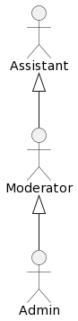
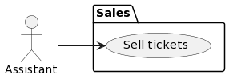
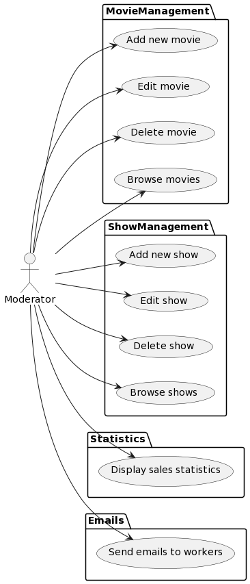
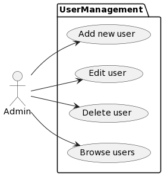
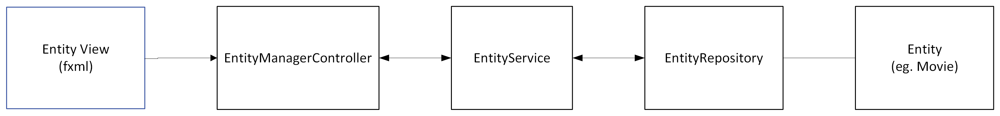
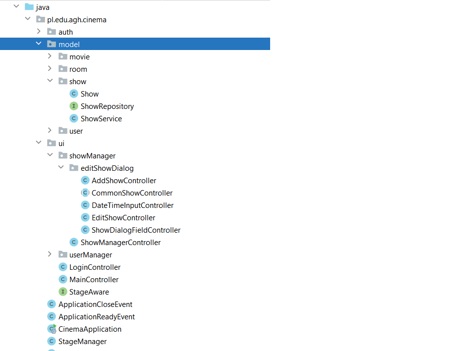
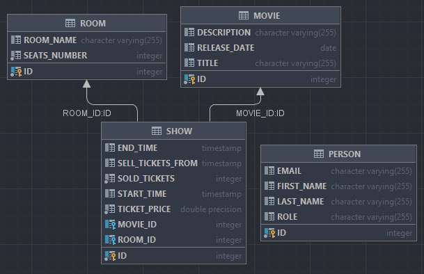
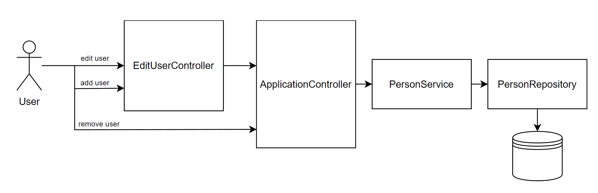
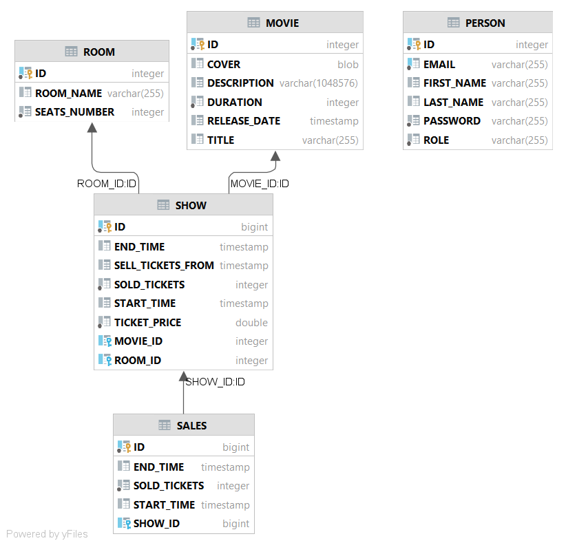

# Cinema

> Poniższa dokumentacja jest oparta na ostatnim pełnym stanie projektu **M3**.

# Wymagania

## Role
W projekcie zdefiniowane 3 role:
1. Assistant (sprzedaż biletów)
2. Moderator (definiowanie filmów i seansów, wyświetlanie statystyk oraz uprawnienia assistanta)
3. Administrator (definiowanie użytkowników oraz uprawnienia moderatora)

## Przypadki użycia

Zdefiniowano pięć pakietów przypadków użycia:
1. Sales
Pakiet zawiera przypadek użycia sprzedaż biletów na dany seans.
   

2. MovieManagement
Pakiet zawiera operacje CRUD dodawanie, edycja, usuwanie, przeglądanie filmów.
Ograniczenie: nie można usunąć filmu jeżeli jest seans.

3. ShowManagement
Pakiet zawiera operacje CRUD dodawanie, edycja, usuwanie, przeglądanie seansów oraz generowanie statystyk.
Ograniczenie: nie można usunąć seansu jeżeli ma sprzedane bilety.
Ograniczenie: nie można dodać dwóch seansów pokrywających się w czasie na tej samej sali.
 

4. Statistics
Pakiet zawiera operację wyświetlania statystyk.

5. UserManagement
Pakiet zawiera operacje CRUD dodawanie, edycja, usuwanie, przeglądanie użytkowników.

   

# Architektura aplikacji

Aplikacja została zrealizowana z użyciem trzech frameworków:
- Hibernate - obsługa bazy danych
- Spring - szkielet aplikacji
- JavaFX - interfejs użytkownika

Zastosowanie frameworka Spring zdominowało architekturę aplikacji. Zastosowane zostały gotowe wzorce: klasy encji, repository
odpowiadające za zapis i odczyt z bazy danych poprzez ORM Hibernate oraz serwisy (logika biznesowa i przechowywanie 
tymczasowych danych na potrzeby interfejsu użytkownika).

Na powyższym rysunku pokazano zbiór klas związanych z obsługą obiektu danego typu (przez entity należy tu rozumieć klasy typu
User, Movie, Show).

**Entity** - jest to klasa modelująca encje obsługiwane i składowane w systemie. Atrybuty klasy są opatrzone adnotacjami Hibernate,
które umożliwiają mapowanie klas entity jako rekordów w bazie danych.

**EntityRepository** - klasa zapewniająca interfejs dostępu do bazy danych, jej metody mogą być wygenerowane automatycznie przez Spring,
ale można też zdefiniować własne, dostarczając w formie adnotacji kod SQLa np:

<code>
@Query(value="SELECT * from Show WHERE movie_id=?1", nativeQuery = true)
List<Show> getShowsForMovie(Long id);
</code>

**EntityService** - komunikuje się z EntityRepository, a także przechowuje na potrzeby interfejsu listę dostępnych obiektów.
Są one obserwowano przez kontrolery JavaFX.

**EntityManagerController** - jest klasą kontrolera obsługującą widok w interfejsie użytkownika. Reaguje ona na akcje użytkownika,
oraz zmiany w obserwowanych obiektach.

**Entity View** - ma postać pliku w formacie xml, definiującą kontrolki interfejsu użytkownika. W trakcie
inicjalizacji widoku plik xml jest ładowany i jego elementy są wiązane z atrybutami klasy EnityManagerController.

# Struktura kodu w projekcie

Projekt ma strukturę jak na poniższym rysunku. Wewnątrz pakietu model umieszczono encje oraz obok klasy repository i service.
Analogiczny podział zastosowano dla pakietu UI, gdzie zdefiniowano podpakiety, zawierające klasy do obsługi okien dialogowych
powiązanych z encją danego typu.

Definicje widoków znajdują się w katalogu resources fxml.

# Projekt bazy danych

Schemat bazy danych został wygenerowany na podstawie adnotacji Hibernate w klasach modelu.
Modele danych są mapowane na tabele w bazie danych przy użyciu JPA.
W projekcie użyto bazy h2 w konfiguracji embedded, to znaczy z zapisem w lokalnym pliku dyskowym.

### Tabela Person

Zawiera użytkowników aplikacji. Użytkownik posiada imię, nazwisko, adres email oraz funkcję. Na razie przewidziano 3 funkcje użytkowników - sprzedawca biletów, moderator zajmujący się obsługą sal oraz administrator.

### Tabela Movie

Zawiera dostępne filmy. Film posiada tytuł, opis, datę wydania i odniesienie do spektakli, na których jest wyświetlany.

### Tabela Room

Zawiera sale kinowe. Sala posiada nazwę oraz liczbę miejsc.

### Tabela Show

Zawiera spektakle. Spektakl posiada czas rozpoczęcia, czas zakończenia, film, salę, czas rozpoczęcia sprzedawania biletów, cenę biletu, liczbę sprzedanych biletów.

# Główna aplikacja

Jej głównym zadaniem jest inicjalizacja JavaFX i Spring, z odpowiednimi ustawieniami. Proces ten zaczyna się w *CinemaApplication.java*. Uruchamia on event odpowiedzialny za utworzonie głównego okna aplikacji oraz rejestruje beany dające dostęp do aplikacji.

*StageManager.java* jest rdzeniem aplikacji, który może uruchomić i zamknąć program z dowolnego miejsca aplikacji (rejestruje EventListener'y, które odbierają eventy za to odpowiedzialne; np. *CinemaApplication.java* wywołuje event uruchomienia) oraz zapewnia dostęp do głównego widoku.

Zadaniem *ViewManager.java* jest załadowanie widoku FXML i utworzenie controllerów odpowiedzialnych za nie poprzez Spring'a. Dzięki temu obiekty w controllerach zostaną wstrzyknięte przez Spring'a.

### *ApplicationController*

Odpowiada za główne okno aplikacji, w którym znajduje się lista osób oraz przyciski do zarządzania nimi. Mogą one tworzyć, edytować i usuwać użytkowników. W przypadku tworzenia i edycji otwierany jest osobne okno, w którym można wprowadzić dane.

#Etapy projektu

## Kamień milowy M1
Zaimplementowano funkcjonalność dodawania użytkownika.

Dodawanie użytkownika jest obsługiwane przez ApplicationController - ma on dostęp do serwisu użytkowników PersonService. Po wybraniu przycisku dodania/edycji użytkownika wyświetla się formularz
obsługiwany przez EditUserController, w którym trzeba wprowadzić poprawne dane użytkownika. W miarę rozwoju projektu ulegnie to zapewne zmianie, ponieważ lista użytkowników nie będzie raczej wyświetlana w widoku głównym. 

Funkcjonalności projektu zostały podzielone na następujące grupy:
- część głównej aplikacji - zarządzająca uruchomieniem aplikacji oraz inicjalizacją Spring'a i JavaFX'a
- część UI - odowiedzialna za zarządzanie widokiem, prezentacją danych i komunikacją z użytkownikiem
- część modeli danych - tworzy modele bazodanowe, zapewnia komunikację z bazą danych poprzez API i udostępnia serwisy
  do swoich modeli

## Kamień milowy M2

Zaimplementowano:
1. Funkcjonalność logowania się użytkownika - użytkownik podaje swój login (email) oraz hasło, po czym naciska przycisk
2. Definiowanie filmów - utworzono widok listy filmów oraz przyciski umożliwiające wywołanie funkcji dodawania, edycji i usuwania
3. Definiowanie seansów - utworzono widok listy saensów oraz przyciski umożliwiające wywołanie funkcji dodawania, edycji i usuwania,
przy dodawaniu seansu trzeba wybrać film i salę z rozwijanej listy, oraz datę i godzinę rozpoczęcia i zakończenia pokazu.
4. Odczyt sal z pliku JSON i zapis w bazie danych
5. System sprzedaży biletów

## Kamień milowy M3

Zaimplementowano:
1. Statystyki dotyczące sprzedaży biletów (ilość i cena).
2. Dodano system wysyłania maili do pracowników i rekomendacji filmów.
3. Zmieniono design aplikacji na nowoczesny.

# Statystyki

W kolejnym etapie prac nad projektem zaimplementowano statystyki sprzedaży.
W projekcie nie jest przetwarzana informacja o sprzedawanych biletach, a jedynie ich aktualna liczba jest atrybutem seansu. Na potrzeby
statystyk dodano do bazy danych tabelę sales, której przeznaczeniem jest zbieranie informacji o liczbie sprzedanych biletów w danym
przedziale czasu (zwykle jednej godziny). Tym samym tabela sales przechowuje dane historyczne, a nie transakcyjne i w zasadzie powinna
być elementem hurtowni danych.

Rozszerzono generator danych (kod w klasie `ShowsGenerator`).
* Automatycznie generowane są seanse w ciągu ostatnich 45 dni. W ten sposób w programie generowanych jest 900 seansów.
* Następnie w okresie 31 dni co godzinę od 8:00 do 22:00 generowane są rekordy tabeli sales z symulowaną wartością sprzedaży na poszczególne
aktywne seanse (seans w danym momencie jest aktywny jeśli sprzedaż biletów już się rozpoczęła i nie osiągnięto jeszcze czasu wyświetlana filmu)
W dniu seansu sprzedaż jest większa niż w dniach poprzedzających.

W ten sposób generuje się około 62000 rekordów sales.

Do projektu dodano klasę `SalesRepository` z metodami pozwalającymi na wyznaczenie liczby sprzedanych biletów oraz wartości sprzedaży
w danym dniu dla wybranego lub wszystkich filmów. Kolejną klasą jest `SalesService`, która zwraca informację o liczbie sprzedanych biletów lub wartości sprzedaży dla kolejnych dni z wybranego
przedziału.

Dodano okno dialogowe statystyk pozwalające na wybór filmu, przedziału czasu (ostatni tydzień lub ostatni miesiąc) oraz typu danych (liczby sprzedanych biletów, lub
ich wartości). Statystyki są wyświetlane w postaci wykresu liniowego.